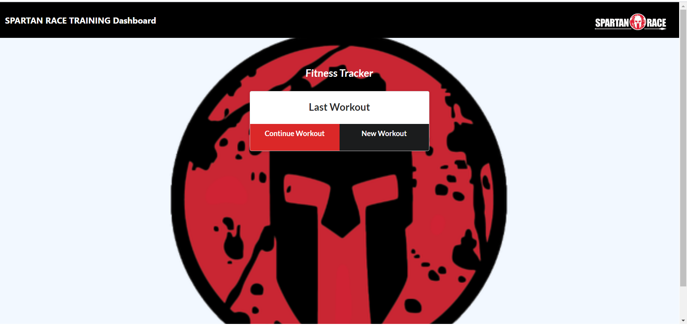

# Spartan Training Tracker

This app provides a convenient place to keep track of your training for the next Spartan Race, with visualizations on total exercise time and weight lifted.  

## Contents | Quick Links
[Getting Started](#start)     |     [Demo](#demo)     |     [Built With](#built)     |     [Authors](#author)     |     [Visuals](#visuals)     |     [Contributing & Tests](Contributing.md)     |     [Contact](#contact)

## [Getting Started](#start)

### Download the app from Git Hub here:
* [Repo URL](https://github.com/JenJayme/spartan-tracker)

### <a id="demo">View a demo:</a> 
* [Deployed on Heroku](https://spartan-tracker.herokuapp.com/#demo)

## [Visuals](#visuals)

## <a id="built">Built With</a>
* HTML5 & CSS
* [Javascript](https://www.javascript.com/)
* [MongoDB](https://www.mongodb.com/)
* [Mongoose](https://mongoosejs.com/)
* [VS Code](https://code.visualstudio.com/)
* [Node.js](https://nodejs.org/)
* [NPM](https://www.npmjs.com/)
* [Express.js](https://expressjs.com/)
* [Heroku](https://www.heroku.com/)

## <a id="contact">Questions</a>
For questions or to discuss collaborations on this or other projects, contact the authors via LinkedIn or GitHub as follows.

## <a id="author">Author</a>

**Jen Jayme** 
[linkedin.com/jenjayme](https://www.linkedin.com/in/jenjayme) 
[github.com/jenjayme](https://github.com/JenJayme)

## Acknowledgements
* Special thanks to Jerome Chenette, Berkeley Coding Boot Camp and Trilogy Education Services for referring this project and key code sections.  